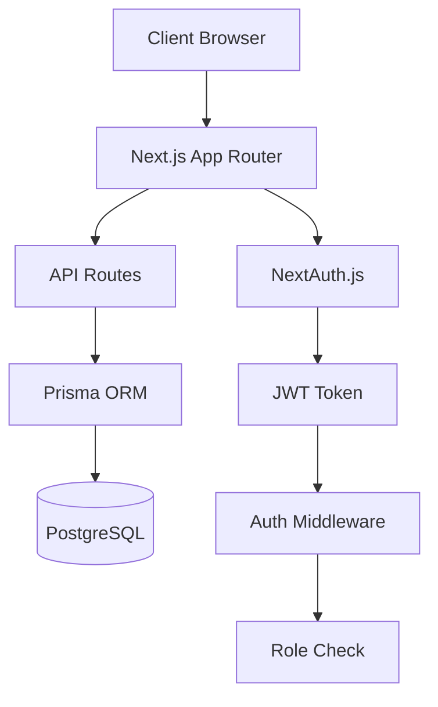

# System Architecture

This document outlines the architectural design of CollabSpace, including its components, data flow, and key design decisions.

## Architecture Overview



## Key Components

### 1. Authentication Layer

The authentication system is built on NextAuth.js and includes:

- Session management
- JWT token handling
- Role-based authorization
- Protected route middleware

Key files:
- `/src/lib/auth.ts`
- `/src/middleware.ts`
- `/src/types/next-auth.d.ts`

### 2. Role Management System

The role system implements a flexible RBAC model with:

- System-wide roles (Admin, User, Guest)
- Context-based roles (System, Workspace, Team)
- Permission management
- Role inheritance

Key files:
- `/src/types/roles.ts`
- `/src/lib/permissions.ts`
- `/src/lib/admin.ts`

### 3. Database Layer

Database management is handled through Prisma ORM with:

- Type-safe database queries
- Migration management
- Seeding functionality
- Relation management

Key files:
- `/prisma/schema.prisma`
- `/prisma/seed.ts`

## Data Flow

1. **Authentication Flow**
   ```mermaid
   sequenceDiagram
       Client->>+Next.js: Login Request
       Next.js->>+NextAuth: Authenticate
       NextAuth->>+Database: Verify Credentials
       Database-->>-NextAuth: User Data
       NextAuth->>NextAuth: Generate JWT
       NextAuth-->>-Next.js: Session
       Next.js-->>-Client: Auth Cookie
   ```

2. **Authorization Flow**
   ```mermaid
   sequenceDiagram
       Client->>+Middleware: Request Protected Route
       Middleware->>+JWT: Verify Token
       JWT-->>-Middleware: Token Data
       Middleware->>+RBAC: Check Permissions
       RBAC-->>-Middleware: Authorization Result
       Middleware-->>-Client: Response/Redirect
   ```

## Security Considerations

1. **Authentication Security**
   - JWT token management
   - Session security
   - Password hashing
   - CSRF protection

2. **Authorization Security**
   - Role-based access control
   - Permission validation
   - API route protection
   - Middleware checks

3. **Data Security**
   - Input validation
   - Query sanitization
   - Error handling
   - Rate limiting

## Performance Optimizations

1. **Database Optimization**
   - Indexed queries
   - Relation management
   - Connection pooling
   - Query optimization

2. **API Optimization**
   - Response caching
   - Pagination
   - Data filtering
   - Batch operations

## Future Considerations

1. **Scalability**
   - Horizontal scaling
   - Load balancing
   - Caching strategies
   - Database sharding

2. **Monitoring**
   - Error tracking
   - Performance monitoring
   - User analytics
   - Audit logging
